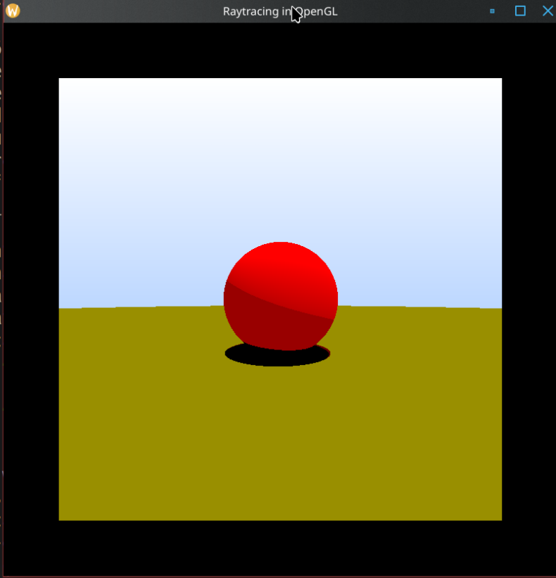
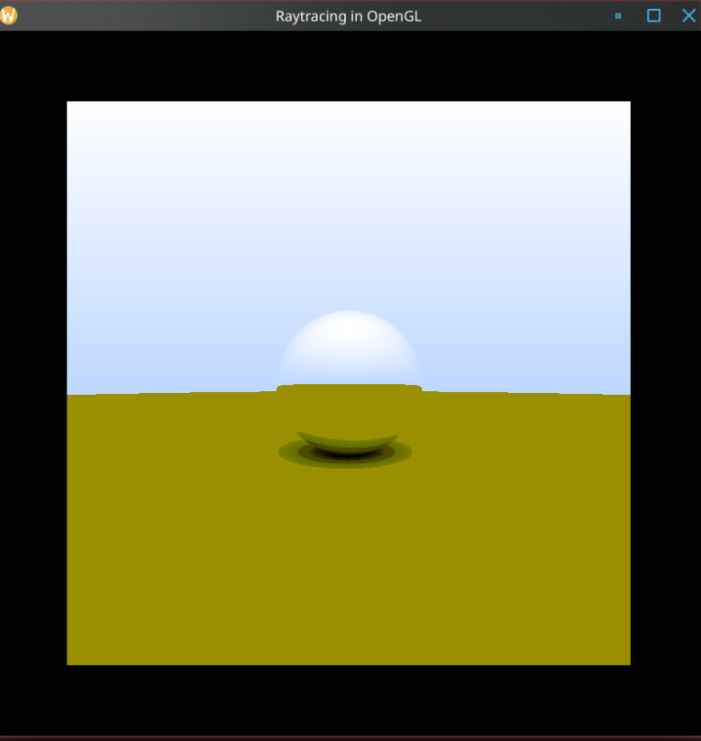
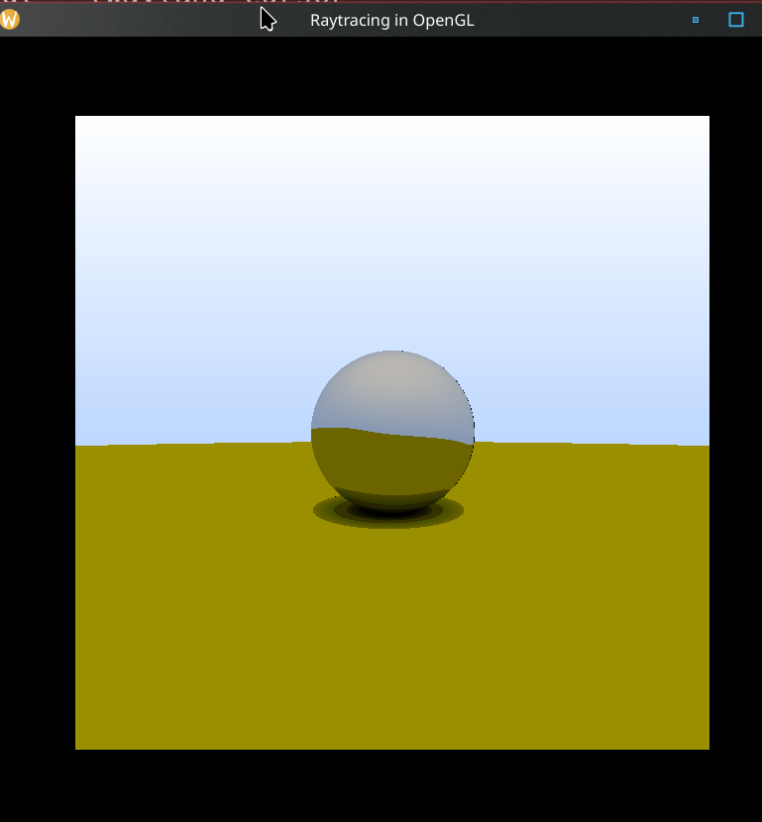
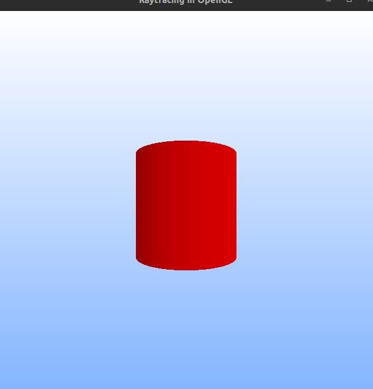
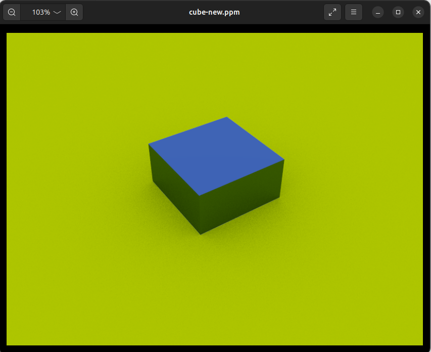
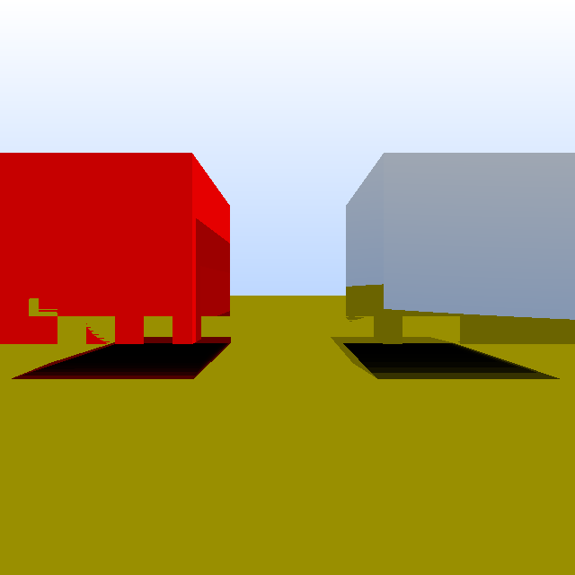

## Table of contents:


- [Aim of the project](https://github.com/JaytidaA/SRA-Ray_Tracer_from_Scratch?tab=readme-ov-file#aim-of-the-project)
    
- [Clone and build the programs in the repository](https://github.com/JaytidaA/SRA-Ray_Tracer_from_Scratch/blob/main/README.md#clone-and-build-the-programs-in-the-repository)
    
- [Programming Languages Used](https://github.com/JaytidaA/SRA-Ray_Tracer_from_Scratch/blob/main/README.md#programming-languages-used)
    
- [Libraries Used](https://github.com/JaytidaA/SRA-Ray_Tracer_from_Scratch/blob/main/README.md#libraries-used)
    
- [Results](https://github.com/JaytidaA/SRA-Ray_Tracer_from_Scratch/blob/main/README.md#results)
    
- [Contributors](https://github.com/JaytidaA/SRA-Ray_Tracer_from_Scratch/blob/main/README.md#contributors)
    
- [Acknowledgements](https://github.com/JaytidaA/SRA-Ray_Tracer_from_Scratch?tab=readme-ov-file#acknowledgements)

## Aim OF THE PROJECT
The aim of the project is to create a simple Ray Tracing application from scratch.

## Clone and build the programs in the repository
[](https://github.com/JaytidaA/SRA-Ray_Tracer_from_Scratch#clone-and-build-the-programs-in-the-repository)

Clone the repo:
```shell
git clone https://github.com/JaytidaA/SRA-Ray_Tracer_from_Scratch
```

To run the main application program just run the `Makefile` program:
```shell
make
```

If you have the `prime-run` program installed on your system and an NVIDIA graphics card then run the following program:
```shell
make prime-run
```

## Programming Languages Used
[](https://github.com/JaytidaA/SRA-Ray_Tracer_from_Scratch#programming-languages-used)

- C++
- GLSL

## Libraries Used
[](https://github.com/JaytidaA/SRA-Ray_Tracer_from_Scratch#libraries-used)


- GLFW  - Graphics Library Framework (GLFW) allows users to create and manage OpenGL windows, while handling keyboard, mouse and joystick inputs. GLFW and FreeGLUT are alternatives to the same functions.
- GLEW  - GLEW (OpenGL Extension Wrangler Library) is a cross-platform C/C++ extension loading library that provides an effcient mechanism to determine which extensions are supported on the platform.
- GLM   - GLM is a C++ mathematics library for graphics software based on the OpenGL Shading Library(GLSL) specification. We used the GLM library to provide animations to the shapes we rendered using Modern OpenGL. GLM library provides us with matrices and vectors which can be passed to the draw call, and refresh the indices of the shapes rendered, resulting in motion.
- IMGUI - Immediate Mode Graphical User Interface is a popular library used primarily in C++ for creating graphical user interfaces (GUIs) in applications. It's particularly popular in game development, tools, and applications where performance and ease of use are critical.

## Results

Rendering spheres of different materials:
<center><div style="display: flex; justify-content: space-between;">



</div></center>

Rendering a cylinder:



Rendering cubes:
<center><div style="display: flex; justify-content: space-between;">


</div></center>

Implementing GUI on the cylinder:


## Contributors
[](https://github.com/JaytidaA/SRA-Ray_Tracer_from_Scratch?tab=readme-ov-file#contributors)

- [Rudrakshi Kubde](https://github.com/RudrakshiKubde)
- [Rakshitha Kowlikar](https://github.com/RakshithaKowlikar)
- [Aaditya Joil](https://github.com/JaytidaA)

# Resources
[](https://github.com/JaytidaA/SRA-Ray_Tracer_from_Scratch#resources)

- [SRA VJTI](https://sravjti.in).
- [Documentation for OpenGL](https://docs.gl)
- [Project Report](https://github.com/JaytidaA/SRA-Ray_Tracer_from_Scratch/blob/main/Project_Report.pdf).
- [The Cherno's OpenGL Tutorial](https://www.youtube.com/playlist?list=PLlrATfBNZ98foTJPJ_Ev03o2oq3-GGOS2)
- [Referred this to implement OpenGL functions and use GLM](https://learnopengl.com)
- [Ray Tracing in One Weekend](https://raytracing.github.io/books/RayTracingInOneWeekend.html)

# Acknowledgements
[](https://github.com/JaytidaA/SRA-Ray_Tracer_from_Scratch#acknowledgements)

- Special thanks to our mentors Anish Mahadevan for guiding us through the Eklavya program.
- Special thanks to Yan Chernikov, Joey de Vries and Peter Shirley as well for their amazing projects which help made this one easier.
