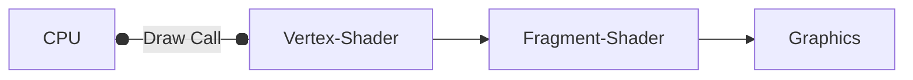

# Introduction
It is **NOT** a Framework/Library, it is a set of Cross-Platform specifications which are implemented by the GPU Manufacturers. Although it has *Open* in its name, it is not Open Source in nature as the implementation(drivers) are guarded industry-secrets.

We can compare them to functions in C++, the function prototype:
```cpp
template <typename T, typename T1, typename T2>
T func_name(T1, T2);
```
is the Open G.L. specification; and the actual implementation is the function definition written by the programmer.

[Useful Documentation for Modern `OpenGL`](https://docs.gl/)
# G.L.F.W.
It is a library which stands for `Graphics Library(GL) Framework`, it is used to mostly open `OpenGL` contexts and work with Windows on different Operating Systems.

# G.L.E.W.
It stands for `GL Extension Wrangler` and is basically used to get the `OpenGL` function prototypes from the drivers and return the function pointers pointing towards them. It is also useful in linking the binaries during the compilation process.

| Important: `GLEW` methods can only be used once an `OpenGL` context has been initialised. |
| ----------------------------------------------------------------------------------------- |
# Drawing Stuff in Modern `OpenGL`
We need to make sure two things exist:
1. Vertex Buffer: It is a blob of memory in the GPU to store Location Data
2. Shader: It is a program which runs on the GPU and tells it how to interpret the Data inside the Vertex Buffer.

> `OpenGL` is a state Machine, meaning all the functions are used to set or get some state in `OpenGL`. 

[What is `OpenGL`?](https://paroj.github.io/gltut/Basics/Intro%20What%20is%20OpenGL.html)

In most cases, the way `OpenGL` works is that we assign some particular index to an object(buffer, array, shader, etc.) and then we use that assigned index to make transformations to the particular object. Like a Primary Key in DBMS.

## Single State Machine
`OpenGL` is a single state machine, meaning that at a time, only a single state can be managed by `OpenGL`.
+ I want to draw a bunch of vertices onto the screen, then I would have to bind a buffer(represented by its index) to the `GL_ARRAY_BUFFER` target and then give the required rules for rendering.
+ Now to draw another set of vertices, I would have to change the state of the `OpenGL` context by binding the new buffer(also represented by its index) to `GL_ARRAY_BUFFER` and then give the appropriate draw call.
We see that at a time, `OpenGL` can only handle processes related to one state, parallel state handling does not exist in `OpenGL`.

| Note: <span style="font-weight: 400;">The GPU handles Parallel Processes all the time but this is related to rendering and must not be confused with the `OpenGL` API State Handling not being able to handle simultaneous states.</span> |
| ----------------------------------------------------------------------------------------------------------------------------------------------------------------------------------------------------------------------------------------- |
# Vertex Attributes
A vertex in `OpenGL` is not a vertex in the traditional sense(referring to only the position coordinates of a Point), but rather a complex structure containing Point related information such `Positions`, `Texture Coordinates`, `Normals`, etc.
```cpp
#pragma pack(push, 1)
// Important as the vertex attribute function is uses byte addressed memory locations
struct Vertex{
	float position[3];
	float normal[3];
	float texture_Coords[2];
};
#pragma pack(pop)
```
We use the `OpenGL` function `glVertexAttribPointer` to specify the layout of the Vertex coordinates. It has the following prototype.

```cpp
void glVertexAttribPointer(uint_t index,
						   size_t size,
						   GLenum type,
						   GLboolean normalized,
						   size_t stride,
						   void * pointer);
```
1. `index`: What should the index of the attribute be in your buffer (0, 1, 2, 3, ...), this will help the shader in while accessing the buffers.
2. `size`: It tells us how many elements are in the particular attribute, e.g. `position` and `normal` will have 3 but `texture_Coords` will have 2.
3. `type`: It is the actual type of the elements of the attribute, in this case all are floats.
4. `normalized`: It is just an enumerated boolean value which tells whether the values should be squished down between `[-1, 1]` or `[0, 1]` or should be converted to floats as is.
5. `stride`: It is used to tell the total size of each vertex, so it is easier for the shader to iterate over the Vertex Buffer.
6. `pointer`: At how many bytes from the Start of the Vertex, does the current attribute which you are specifying appear? We can use `(const void*) someIntegerValue` to convert the distance from a number to a pointer which can be used for pointer arithmetic.

One call of this function specifies to the `OpenGL` context, the layout of the particular attribute you are giving the information for. If you call this function once more with the Attribute Layout information for another attribute, then the layout information for that Attribute is updated inside the State Machine as well.

| Important: <span style="font-weight: 400;">After setting the Attribute State, we also need to enable this Attribute using the `glEnableVertexAttribArray(uint_t attrIdx)` </span> |
| --------------------------------------------------------------------------------------------------------------------------------------------------------------------------------- |
| This `attrIdx` is the same index appointed to the attribute in the above function.                                                                                                |

# Shaders
A shader is basically a program which runs on the GPU and tells the GPU(broadly speaking) how to render specific objects. We use shaders to access the fast parallel computation speed of the GPU, or even just rendering of basic shapes.

Shaders in `OpenGL` work on the state machine like everything else.

The two most popular types of shaders are:
1. Vertex Shaders
2. Fragment/Pixel Shaders

## Basic overview of the rendering pipeline

## Vertex Shaders
+ The code present in the Vertex Shader gets called for rendering each vertex inside the Vertex Buffer. The primary purpose of the Vertex Shader is to render the vertices at the correct position coordinates inside the window.
+ It also passes the attribute information to the next stage.

## Fragment Shaders
+ The code present in the Fragment Shader runs once for each pixel in the window that needs to be rasterised.
+ The primary function of the fragment shader is to determine the actual colour of the pixel that needs to be drawn.


+ Sometimes some critical applications are better performed lesser times in the Vertex Shader as compared to the Fragment Shader.

# Index Buffers
Many a times we have to render shapes which are more complex than a Triangle(e.g. a quadrilateral), but the basic primitive for Image rendering are always triangles so we **have** to somehow use triangles to create a quadrilateral.

The easiest way to do this is to make use of two triangles to form a quadrilateral as follows:

To draw this quadrilateral, we may specify the vertex array as:
```cpp
Vertex vtx_Array1[3] = {A, B, C};
Vertex vtx_Array2[3] = {C, D, A};
//Vertex is a struct containing the Vertex information
```
and then render the two triangles from these 6 data points. But as we can see, this method is very inefficient as we have to store copies of a few common data points in the GPU Memory, it may not be a huge problem for now but for complex shapes with many vertices, this leads to wastage of memory for the GPU.
## How to prevent this?
We make use of something called an Index Buffer, this is a special data structure that is used to store the Indices of the Vertices to be rendered. We make use of the Index buffer as follows:
```cpp
Vertex vtx_Array[4] = {A, B, C, D};
// The array buffer has already been generated and this above array has already been dtored inside it.

uint32_t indices[6] = {
	0, 1, 2, /* First Triangle */
	2, 3, 0  /* Second Triangle */
};

unsigned int index_Buffer;
glGenBuffers(1, &index_Buffer);
glBindBuffer(GL_ELEMENT_ARRAY_BUFFER, index_Buffer);
glBufferData(GL_ELEMENT_ARRAY_BUFFER, 6 * sizeof(uint32_t), indices, GL_STATIC_DRAW);

while(windowshouldbeopen){
	glDrawElements(GL_TRIANGLES    /* mode */,
				   6               /* count */,
				   GL_UNSIGNED_INT /* the type of the index variables */,
				   nullptr         /* the location of the index array, this is 
				                      nullptr since we have bound the array 
				                      using glBindBuffer() */
	);
}
```

We store the indices of the vertices to be rendered in another array, called `indices` in this example, then we load this array into the buffer made specifically to store vertex indices, `GL_ELEMENT_ARRAY` and then we draw the quadrilateral using the `glDrawElements()` instead of the `glDrawArrays()` method. The index buffer is also sometimes referred to as $\text{Index Buffer Object}$ or $\text{IBO}$.

This method ensures that we do not have to store separate copies of the same Vertex object inside the Vertex Buffer.

# Errors in `OpenGL`
Two methods
1. `glGetError()`:
	+ Use this function to get an `GLenum` type which is basically an unsigned integer which represents the error code. You can check what this error code means by converting it to hexadecimal numbers and `grep` searching for it in the `glew.h` header file.
	```bash
	# The Hexadecimal value "500" is just an example
	grep "Ox0500" glew.h
	```

	+ This function has one disadvantage, that if a single function call raises two errors, then it does not return both of them, instead, it returns only one of them, so we must continually call this function using a `while` loop, until this function does not return `GL_NO_ERROR` which is equal to zero.

1. `glDebugMessageCallback():
   This is a new function introduced in `gl4.3` so many developers do not use this function to ensure backward compatibility.